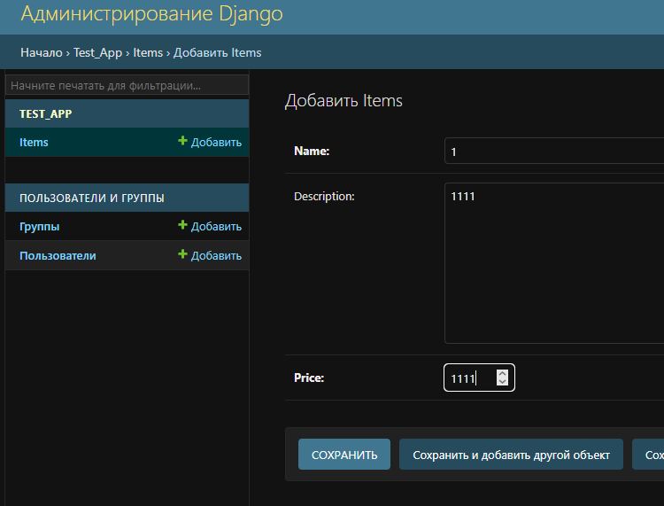
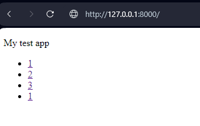
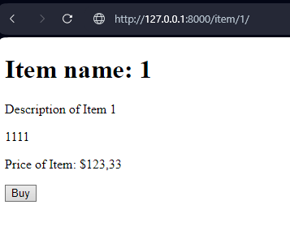
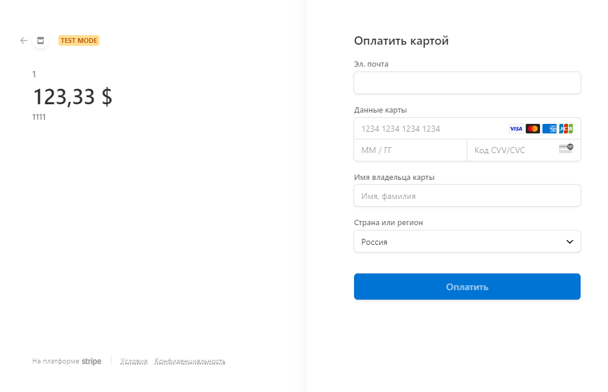
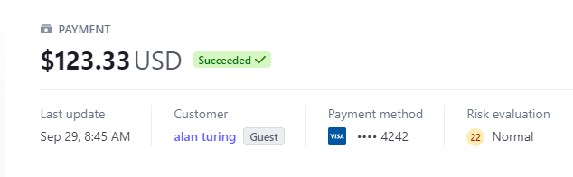

### [ReadmeRU](https://github.com/alexroot-coder/test_task_django_Rishat/blob/master/Readme.ru.md)
# Django + Stripe API
## _Solution of a [test task](https://github.com/alexroot-coder/test_task_django_Rishat/blob/master/Тестовое_задание_для_Python_разработчика.pdf)  for ООО Ришат_

## Installation


Step one clone app:
```sh
git clone https://github.com/alexroot-coder/test_task_django_Rishat.git
```
Step two setup pyvenv and install requirements:
```sh
cd test_task_django_Rishat
python3 -m venv venv
source venv/bin/activate
pip3 install -r requirements.txt
```
Step three set environment variables by edit your own .env-file:

```sh
SECRET_KEY=your_django_very_secret_key
STRIPE_PUBLIC_KEY=your_stripe_pk_test_public_key
STRIPE_SECRET_KEY=your_stripe_sk_test_secret_key
DEBUG=False
ALLOWED_HOSTS=*,127.0.0.1,localhost
``` 
Step four make migrations to create database:
```sh
cd task_app &&  python3 manage.py makemigrations
python3 manage.py migrate
``` 

Step five create your superuser for django-admin-panel:
```sh
python3 manage.py createsuperuser
...
``` 
Step six collect static files:
```sh
python3 manage.py collectstatic
``` 

Step seven run the app using the following command:
```sh
python3 manage.py runserver
``` 
Verify the deployment by navigating to your server address in your preferred browser.
```sh
127.0.0.1:8000
```

## Run app using Docker

The project already contains a dockerfile, just build the container:
```sh
docker build . --tag your_name_of_container
```

Or pull it from DockerHub:
```sh
docker pull aar2k/test_env_django:latest
```


Run a container with app:

```sh
docker run -d -p 8000:8000 --restart=always --env-file .\.env your_name_of_container
```

> `--env-file` specify the file with environment variables
> 
> `-d` running a container in a daemon
>
> `-p` set up ports

Make some settings:
```sh
docker exec -it YOUR_CONTAINER_ID python manage.py makemigrations
docker exec -it YOUR_CONTAINER_ID python manage.py migrate
docker exec -it YOUR_CONTAINER_ID python manage.py createsuperuser
docker exec -it YOUR_CONTAINER_ID python manage.py collectstatic 
```

Verify the deployment by navigating to your server address in your preferred browser.

```sh
127.0.0.1:8000
```
## Usage

Login to django-admin-panel and fill data to django-model:
```sh
127.0.0.1:8000/admin
```




Go to homepage and check fill data



Choose any item and click buy button



We got a stripe checkout session 



Use test data for payment


Stripe API dashboard log



Using curl:

```sh
curl -X GET http://127.0.0.1:8000/item/1/
```

## FeedBack

**Thank you for the test task. I’m ready for adequate criticism, I’m waiting for full feedback😀. I will solve the remaining bonus tasks in my free time.**

[](https://t.me/yavamnerobot)
[](mailto:alexrozhentsev@gmail.com)


