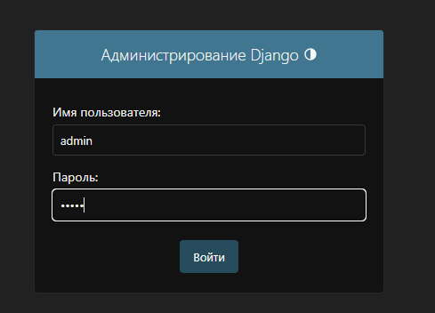
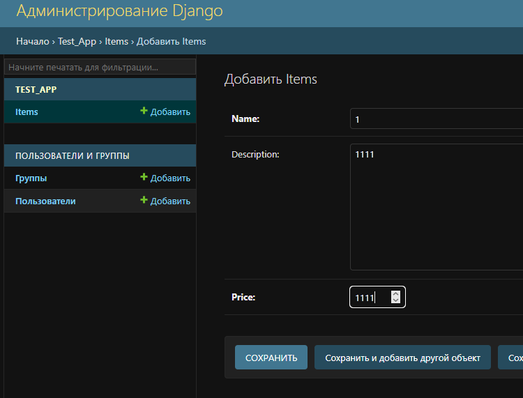
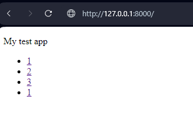
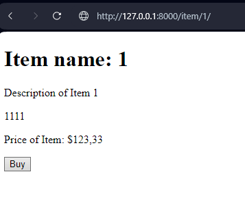
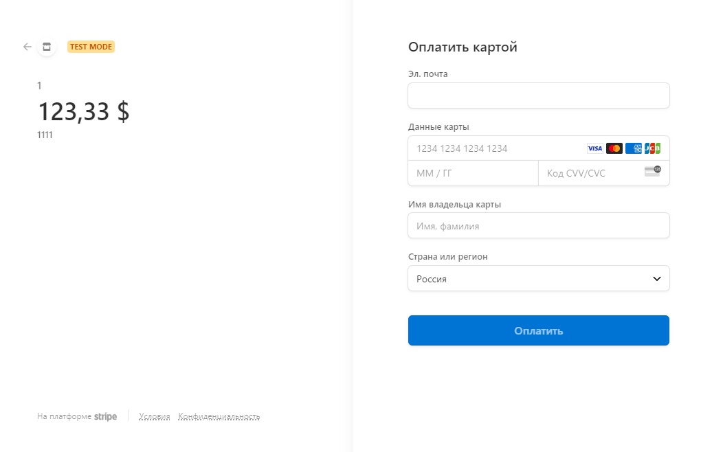
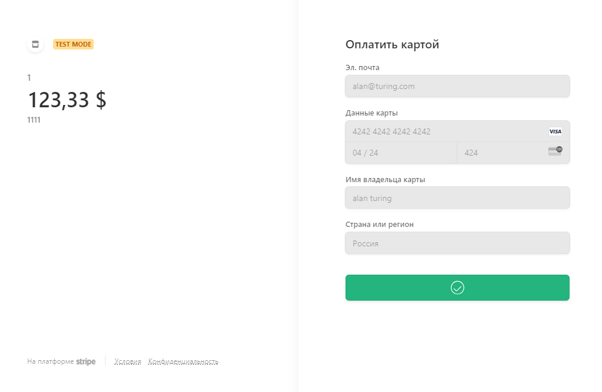
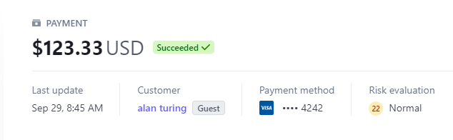

### [ReadmeENG](https://github.com/alexroot-coder/test_task_django_Rishat/blob/master/Readme.md)
# Django + Stripe API
## _Решение [тестового задания](https://github.com/alexroot-coder/test_task_django_Rishat/blob/master/Тестовое_задание_для_Python_разработчика.pdf)  для ООО Ришат_

## Установка

Склонируйте репозиторий:
```sh
git clone https://github.com/alexroot-coder/test_task_django_Rishat.git
```
Создайте виртуальное окружение и установите зависимости:
```sh
cd test_task_django_Rishat
python3 -m venv venv
source venv/bin/activate
pip3 install -r requirements.txt
```
Задайте переменные окружения в файле .env:

```sh
SECRET_KEY=your_django_very_secret_key
STRIPE_PUBLIC_KEY=your_stripe_pk_test_public_key
STRIPE_SECRET_KEY=your_stripe_sk_test_secret_key
DEBUG=False
ALLOWED_HOSTS=*,127.0.0.1,localhost
``` 
Выполните миграцию для создания базы данных:
```sh
cd task_app &&  python3 manage.py makemigrations
python3 manage.py migrate
``` 

Создайте суперпользователя для панели администратора django:
```sh
python3 manage.py createsuperuser
...
``` 
Сбор статических файлов:
```sh
python3 manage.py collectstatic
``` 

Запустите приложение, используя следующую команду:
```sh
python3 manage.py runserver
``` 
Проверьте развертывание, перейдя по адресу вашего сервера в предпочитаемом вами браузере:
```sh
127.0.0.1:8000
```

## Run app using Docker

Проект уже содержит файл docker, просто создайте контейнер:
```sh
docker build . --tag your_name_of_container
```

Или запульте его из DockerHub:
```sh
docker pull aar2k/test_env_django:latest
```


Запустите контейнер с приложением:

```sh
docker run -d -p 8000:8000 --restart=always --env-file .\.env your_name_of_container
```

> `--env-file` укажите файл с переменными среды
> 
> `-d` запуск контейнера в демоне
>
> `-p` настройка портов

Сделайте некоторые настройки:
```sh
docker exec -it YOUR_CONTAINER_ID python manage.py makemigrations
docker exec -it YOUR_CONTAINER_ID python manage.py migrate
docker exec -it YOUR_CONTAINER_ID python manage.py createsuperuser
docker exec -it YOUR_CONTAINER_ID python manage.py collectstatic 
```

Проверьте развертывание, перейдя по адресу вашего сервера в предпочитаемом вами браузере:

```sh
127.0.0.1:8000
```
## Usage

Войдите в панель администратора django и заполните данные в модели django:
```sh
127.0.0.1:8000/admin
```




Перейдите на домашнюю страницу и проверьте данные заполнения



Выберите любой товар и нажмите кнопку «buy»



У нас есть stripe checkout session 



Используйте тестовые данные для оплаты



Журнал панели управления Stripe API



Используя curl:

```sh
curl -X GET http://127.0.0.1:8000/item/1/
```

## FeedBack

**Спасибо за тестовое задание. Готов к адекватной критике, жду полноценной обратной связи😀. Остальные бонусные задания я решу в свободное время.**

[](https://t.me/yavamnerobot)
[](mailto:alexrozhentsev@gmail.com)


